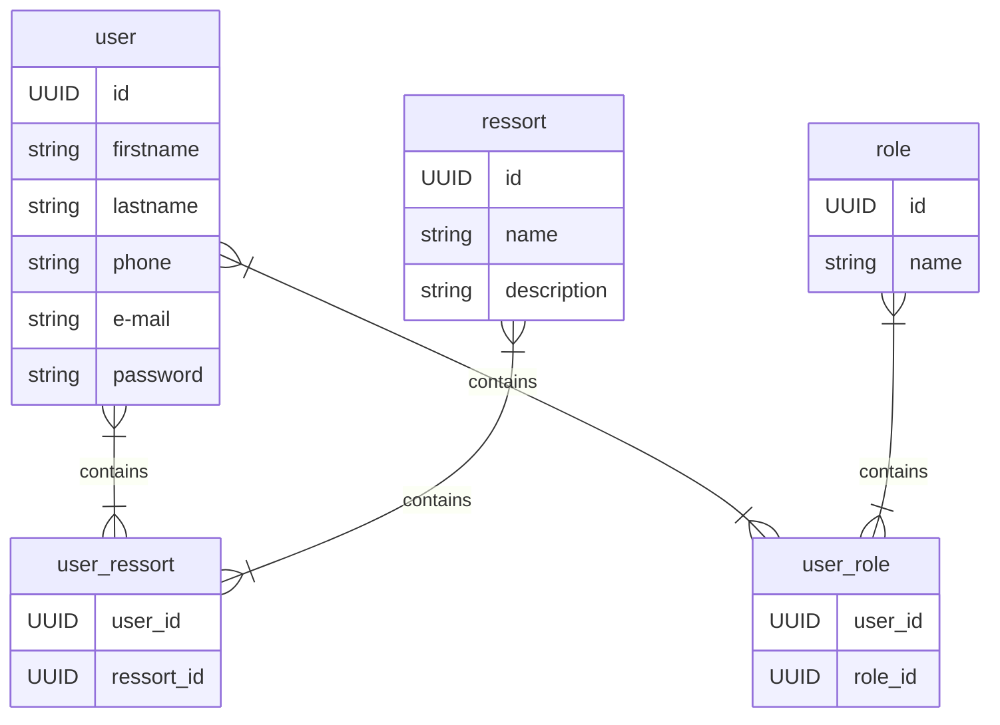
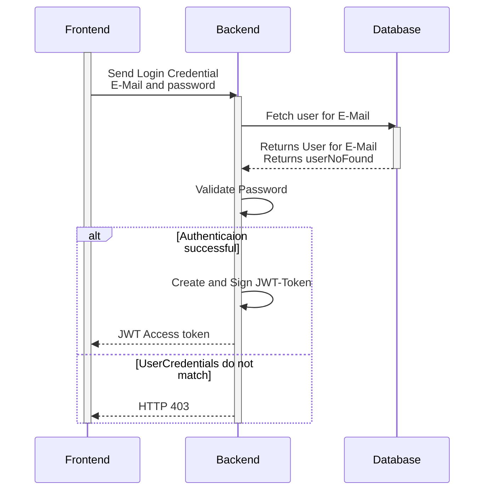
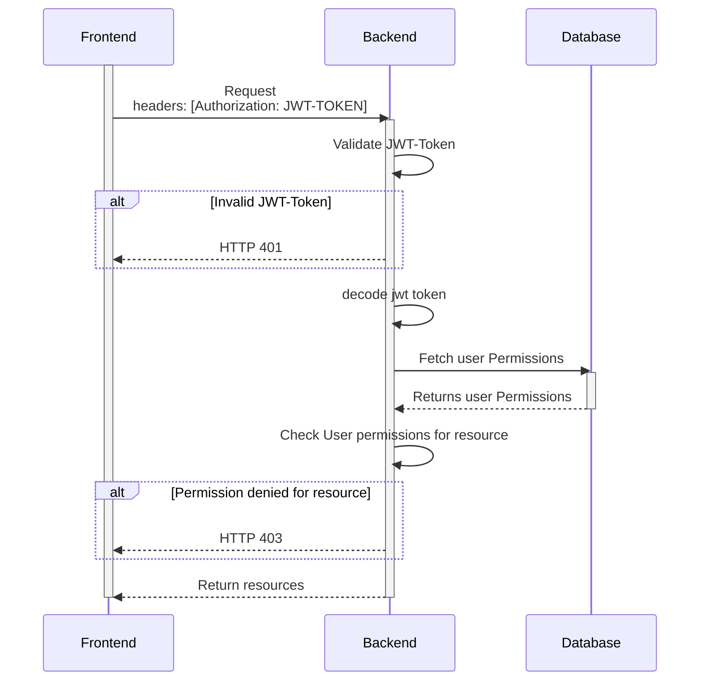

# V7 Website Architecture Documentation
Architecture documentation based on [arc42](https://www.innoq.com/en/blog/brief-introduction-to-arc42/)

## Introduction / Goals

The V7_Website is a website and an application with an internal space for the leader team to organise.

### Quality Goals

The main quality goals of this project include:

- Secure login for internal space
- The public part of the website must be informative, and appealing to visitors
- The application must be easy to use

## Constraints

Coding: There is only one Developer at the moment so to guarantee code quality this project will have to rely on tools for code quality check

## Context and Scope

### System Context

## Solution Strategy

The V7 web team develops this application and uses an open source technology stack, which will consist of a conventional three tier architecture 
with frontend (a single-page application), backend and relational database.

### ER Diagram

This maybe extended in the future with new features

## Building Block View

## Runtime View

### Login and Identification

A successful Login will return a JWT access Token to validate further request.
In addition, the E-Mail will be returned which will be used to authorize requests based on the user roles.

### Authenticate requests and authorize user

Authentication consists of two steps. Check if signed JWT-Token is valid. 
Check user permissions for resource.

## Deployment View

## Crosscutting Concepts

## Architectural Decisions

See [ADR Folder](../adr)

## Quality Requirements

See [Quality Goals](#quality-goals) for some major goals
driving the architecture. This section may describe quality scenarios
in the future.

## Risk & Technical Debt

## Glossary

| Term | Description                    |
|------|--------------------------------|
| V7   | V7 is a youth project in Bauma |

